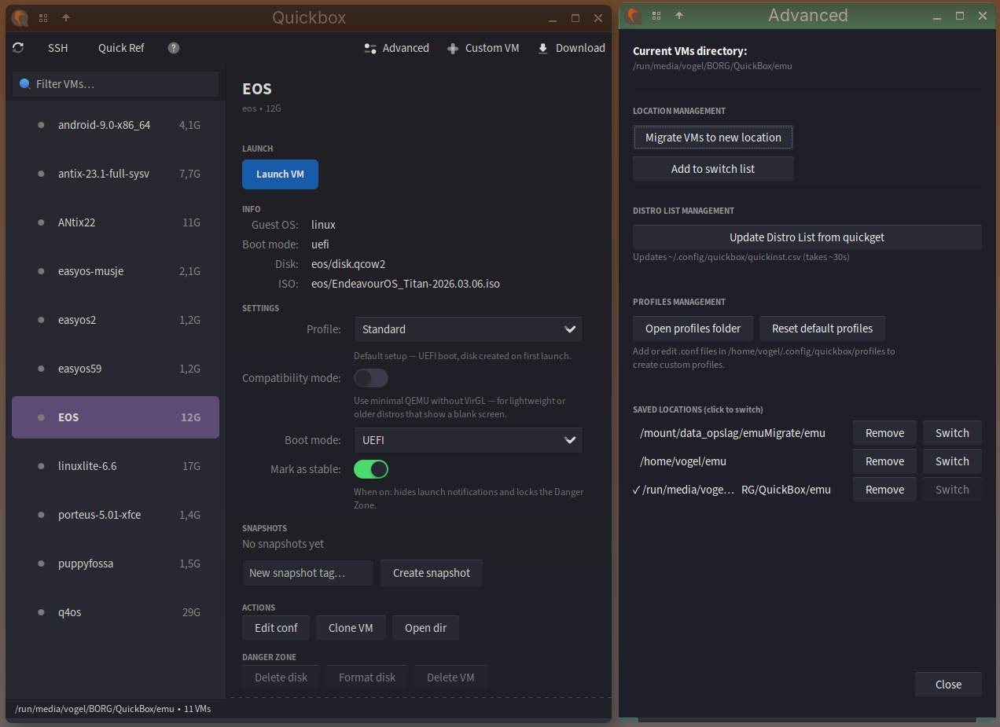
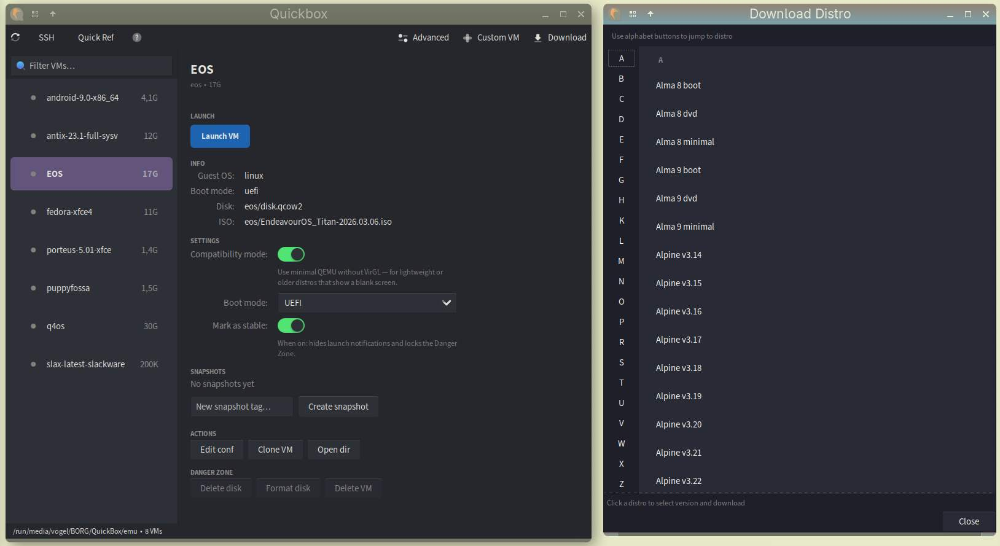

# Quickbox GUI

GTK3-based GUI for managing QEMU virtual machines with quickemu integration.

## Features

VM creation, deletion, start/stop, SSH port management, snapshots, migration, cloning, ISO management, boot order control, UEFI/BIOS support, distro updates. Quickget to get the latest updated distro's. In GUI a refresh button.

## Disclaimer

    **DEVELOPMENT / TESTING PHASE - USE AT OWN RISK**

    This tool is in active development and testing phase.

    Status: Tested for approximately 3 weeks. Overall feels stable.

    Known behavior:
    - Most distros from quickget --list work fine
    - Some distros (e.g. EasyOS) may fail
    - SSH part is a helper tool with basic oneliners and sshd setup - not production-grade
    - Configuration may need adjustments for edge cases

    Tested successfully with: Ubuntu, Debian, Arch, AlmaLinux, Manjaro and others from quickget list.

    Report issues if you encounter problems. Feedback helps improve stability.





## Requirements

- Python 3.6+
- GTK3 (python3-gi, gobject-introspection)
- quickemu (quickget inside)

## Installation

Easiest method using install script:

```bash
sudo ./install.sh
```

Manual installation as root:

```bash
sudo cp quickbox-gui /usr/local/bin/
sudo chmod +x /usr/local/bin/quickbox-gui
sudo cp quickbox-gui.desktop /usr/share/applications/
```

Optional - Alt-F2 launcher support:

```bash
sudo cp quickbox-launch /usr/local/bin/
sudo chmod +x /usr/local/bin/quickbox-launch
```

## Uninstallation

```bash
sudo ./uninstall.sh
```

Or manually remove:

```bash
sudo rm /usr/local/bin/quickbox-gui
sudo rm /usr/local/bin/quickbox-launch (if installed)
sudo rm /usr/share/applications/quickbox-gui.desktop
```

## Usage

Command line:

```bash
quickbox-gui
```

## Configuration

Config stored in ~/.config/quickbox/quickbox-gui.conf

Default VM directory: ~/emu/

## Files

- quickbox-gui: Main Python application
- quickbox-launch: Bash wrapper enables Alt-F2 launcher support (runs python3 quickbox-gui)
- quickbox-gui.desktop: Desktop integration
- install.sh: Installation script
- uninstall.sh: Uninstallation script
- LICENSE: MIT License

## License

MIT - Copyright (c) 2026 Musqz
